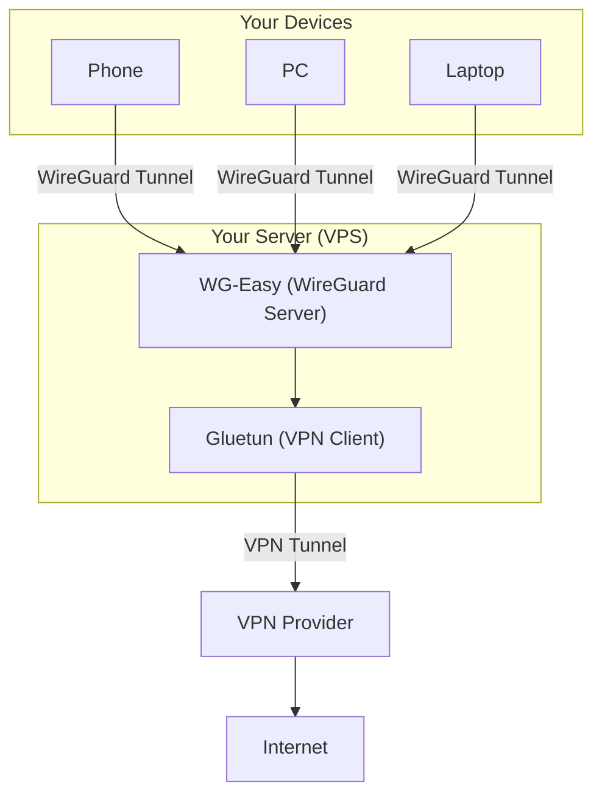

# WireGuard Easy & Gluetun

Build your own self-hosted VPN gateway with a secure and privacy enhanced exit.

All your devices securely connect to your private WireGuard server, where
traffic is managed, and monitored under your control. From there, Gluetun
forwards it through your trusted VPN provider, giving you a single encrypted
exit IP, enhanced privacy, and location masking — all without depending on
third-party infrastructure.

- **Easy WireGuard Management**: Simple web interface for managing WireGuard VPN
  (WG-Easy)
- **VPN Chaining**: All traffic routed through a VPN provider using Gluetun
- **Docker-Based**: Easy deployment with Docker Compose
- **Enhanced Privacy**: Hide your IP address and encrypt your internet traffic
- **Multi-Device Support**: Connect unlimited devices to your VPN network
- **Remote Access**: Secure access to your home network or devices from anywhere
- **DNS Filtering**: Integrated Adguard Home for ad-blocking and tracking
  protection

> **📖 Want to learn more?** Check out this [detailed introduction
> article](https://blog.bktus.com/en/archives/2918/) explaining the principles
> and architecture of this VPN chaining setup.

## 📑 Table of Contents

- [WireGuard Easy \& Gluetun](#wireguard-easy--gluetun)
  - [📑 Table of Contents](#-table-of-contents)
  - [📋 Prerequisites](#-prerequisites)
  - [🏗️ Architecture](#️-architecture)
  - [🔄 About This Project](#-about-this-project)
    - [Synchronization with wg-easy](#synchronization-with-wg-easy)
  - [🚀 Quick Start](#-quick-start)
    - [1. Clone the Repository](#1-clone-the-repository)
    - [2. Configure Environment Variables](#2-configure-environment-variables)
    - [3. Configure AdguardHome (DNS Resolver)](#3-configure-adguardhome-dns-resolver)
    - [4. Start Services](#4-start-services)
    - [5. Access Web Interface](#5-access-web-interface)
  - [⚙️ Configuration](#️-configuration)
    - [Adding Clients](#adding-clients)
    - [Port Forwarding](#port-forwarding)
    - [AdguardHome Web Interface](#adguardhome-web-interface)
    - [Advanced Network Configuration](#advanced-network-configuration)
      - [Hooks for WG-Easy](#hooks-for-wg-easy)
      - [iptables Rules for Gluetun](#iptables-rules-for-gluetun)
  - [🔧 Management](#-management)
    - [View Logs](#view-logs)
    - [Stop Services](#stop-services)
    - [Restart Services](#restart-services)
    - [Update Services](#update-services)
    - [Complete Cleanup](#complete-cleanup)
  - [🛠️ Troubleshooting](#️-troubleshooting)
    - [Connection Issues](#connection-issues)
    - [Logs](#logs)
  - [📚 Additional Resources](#-additional-resources)
  - [🤝 Contributing](#-contributing)
    - [Ways to Contribute](#ways-to-contribute)
  - [⚠️ Disclaimer](#️-disclaimer)


## 📋 Prerequisites

- Docker Engine 20.10 or later
- Docker Compose V2
- A VPN provider account (for Gluetun)
- Root/sudo access on the host machine

✅ Tested on: Raspberry Pi 5 / Kernel v6.16.0 / Docker v28.0.4 / Docker Compose
v2.34.0

## 🏗️ Architecture



**Traffic Flow:**
1. Your device connects to wg-easy via WireGuard (encrypted)
2. wg-easy forwards traffic to Gluetun container
3. Gluetun routes traffic through VPN provider (encrypted again)
4. Traffic reaches the internet with VPN provider's IP address

## 🔄 About This Project

This project is based on [wg-easy](https://github.com/wg-easy/wg-easy) with the
following modifications:

- **Optimized for Gluetun Integration**: Pre-configured network settings for
  seamless VPN chaining
- **Simplified Configuration**: Reduced configuration steps to minimize setup
  errors
- **Docker Compose Ready**: Out-of-the-box Docker Compose configuration for
  quick deployment
- **Contributing Back**: Usability improvements are contributed back to the
  wg-easy project

### Synchronization with wg-easy

This project maintains compatibility with wg-easy by:
- Regularly syncing with the latest wg-easy releases
- Testing all updates for compatibility with Gluetun integration
- Contributing usability improvements and bug fixes back to the upstream project

## 🚀 Quick Start

### 1. Clone the Repository

```shell
git clone https://github.com/saturneric/wg-easy-gluetun.git
cd wg-easy-gluetun
```

### 2. Configure Environment Variables

```shell
cp .env.example .env
```

Edit `.env` file with your settings.

### 3. Configure AdguardHome (DNS Resolver)

```shell
mkdir -p ./data/adguardhome/conf
cp ./conf/AdGuardHome.example.yaml ./data/adguardhome/conf/AdGuardHome.yaml
```

Edit `AdGuardHome.yaml` file with your settings

> Tips: If you do not want to use Adguard Home, you can skip this step and
modify the `.env` and `docker-compose.yml` file to remove the relevant lines.

### 4. Start Services

Check docker compose file for any additional configuration you may need to do,
then start the services:

```shell
sudo docker compose up -d
```

### 5. Access Web Interface

Open your browser and navigate to:
```
http://YOUR_SERVER_IP:51821
```

## ⚙️ Configuration

### Adding Clients

1. Access the web interface (Logged In)
2. Click "New"
3. Enter a name for the device
4. Scan the QR code with WireGuard app or download the config file

### Port Forwarding

Make sure to forward the following ports on your router:
- `51820/udp` - WireGuard VPN
- `51821/tcp` - Web UI (optional, for remote management)

### AdguardHome Web Interface

Access AdguardHome web interface (client must be connected with wireguard
tunnel) at:
```
http://172.31.0.4
```

### Advanced Network Configuration

#### Hooks for WG-Easy

You can customize WG-Easy's network behavior by modifying scripts in the
`hooks/` directory. The hooks are automatically built into the wg-easy container
and executed at the appropriate times.

Don't forget to set corresponding commands in `wg-post-down.txt` to clean up any
changes made in `wg-post-up.txt`.

#### iptables Rules for Gluetun

Gluetun's firewall and routing behavior by modifying the `iptables/` directory.

## 🔧 Management

### View Logs

```shell
docker compose logs -f
```

### Stop Services

```shell
docker compose down
```

### Restart Services

```shell
docker compose restart
```

### Update Services

```shell
docker compose pull
docker compose up -d
```

### Complete Cleanup

To completely remove all containers, images, volumes and data, run:

```shell
docker compose down --rmi all -v
rm -rf ./data
```

**⚠️ Warning**: This will delete all data including WireGuard configurations and
client settings. Make sure to backup any important configurations before running
this command.

## 🛠️ Troubleshooting

### Connection Issues

Check if containers are running:
```shell
docker compose ps
```

### Logs

Verify Gluetun logs:
```shell
docker compose logs gluetun
```

Check WireGuard Easy logs:
```shell
docker compose logs wg-easy
```

## 📚 Additional Resources

- [WireGuard Official Documentation](https://www.wireguard.com/)
- [Gluetun Wiki](https://github.com/qdm12/gluetun-wiki)
- [WG-Easy](https://wg-easy.github.io/wg-easy/v15.1/)
- [Docker Compose Documentation](https://docs.docker.com/compose/)

## 🤝 Contributing

Contributions are welcome! Please feel free to submit a Pull Request.

### Ways to Contribute

- **Report Issues**: Found a bug? Let us know!
- **Suggest Features**: Have ideas for improvements?
- **Submit Pull Requests**: Code contributions are appreciated
- **Upstream Contributions**: Usability improvements may be contributed to
  wg-easy project.

## ⚠️ Disclaimer

This tool is for educational and personal use only. Please ensure compliance
with your VPN provider's terms of service and local regulations.

