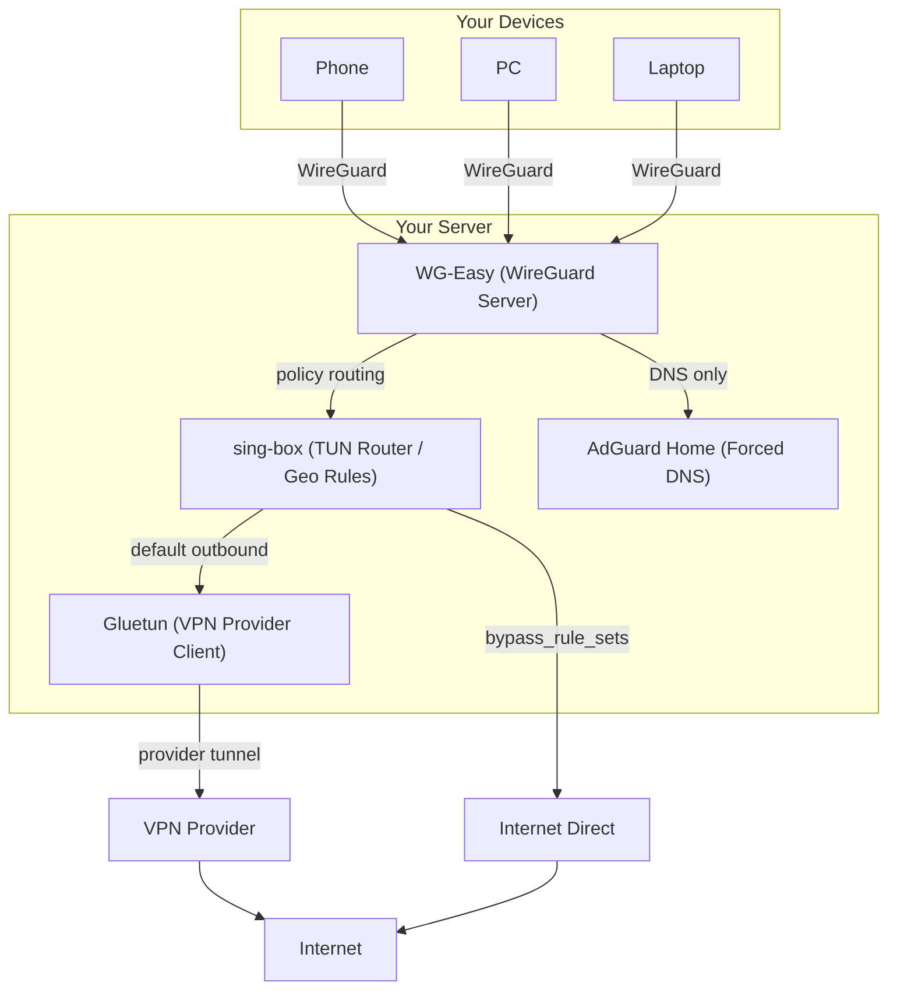

# WG-Easy & Gluetun

Build your own self-hosted VPN gateway with a secure and privacy-enhanced exit.

All your devices securely connect to your private WireGuard server, where traffic
is managed and monitored under your control. From there, sing-box applies
geo-routing rules, and Gluetun forwards everything through your trusted VPN
provider, giving you a single encrypted exit IP, enhanced privacy, and location
masking.

- **Easy WireGuard Management**: Simple web interface for managing WireGuard peers (WG-Easy)
- **VPN Chaining**: All traffic routed through a VPN provider via Gluetun
- **Smart Routing**: sing-box applies geo-based bypass rules before traffic reaches the VPN
- **DNS Filtering**: Integrated AdGuard Home for ad-blocking and tracking protection
- **Single Config File**: All settings live in `config.yaml`; edit once, then run `./up.sh`
- **Docker-Based**: Easy deployment, no other tools required on the host

> **Want to learn more?** Check out this [detailed introduction
> article](https://blog.bktus.com/en/archives/qqyy2t/) explaining the principles
> and technical details behind this project.

> **New Architecture**: The latest version has been redesigned to use sing-box
> as a TUN router, allowing for more flexible and powerful routing rules. Check
> out [the corresponding article](https://blog.bktus.com/en/archives/uqrk3i/)
> for a deep dive into it.

## Table of Contents

- [WG-Easy \& Gluetun](#wg-easy--gluetun)
  - [Table of Contents](#table-of-contents)
  - [Prerequisites](#prerequisites)
  - [Architecture](#architecture)
  - [Quick Start](#quick-start)
    - [1. Clone the Repository](#1-clone-the-repository)
    - [2. Edit `config.yaml`](#2-edit-configyaml)
    - [3. Start the Stack](#3-start-the-stack)
    - [4. Access Web Interfaces](#4-access-web-interfaces)
  - [Configuration](#configuration)
    - [Key Settings](#key-settings)
    - [Adding WireGuard Clients](#adding-wireguard-clients)
    - [Routing Rules (sing-box)](#routing-rules-sing-box)
    - [Direct Subnets (bypass sing-box)](#direct-subnets-bypass-sing-box)
    - [Port Forwarding](#port-forwarding)
    - [Generated Runtime Files](#generated-runtime-files)
  - [Web Interfaces](#web-interfaces)
    - [WG-Easy](#wg-easy)
    - [AdGuard Home](#adguard-home)
  - [Management](#management)
    - [View Logs](#view-logs)
    - [Stop / Restart](#stop--restart)
    - [Update Images](#update-images)
    - [Complete Cleanup](#complete-cleanup)
  - [Troubleshooting](#troubleshooting)
  - [Additional Resources](#additional-resources)
  - [Contributing](#contributing)
  - [Disclaimer](#disclaimer)

## Prerequisites

- Docker Engine 20.10 or later
- Docker Compose V2 or later
- A VPN provider account supported by [Gluetun](https://github.com/qdm12/gluetun-wiki)
- Root/sudo access on the host machine

Tested on: Raspberry Pi 5 / Linux Kernel v6.18 / Docker v29.2.1 / Docker Compose v5.0.2

## Architecture


```mermaid
flowchart TD
  subgraph devices["Your Devices"]
    phone["Phone"]
    pc["PC"]
    laptop["Laptop"]
  end

  subgraph server["Your Server"]
    wgeasy["WG-Easy (WireGuard Server)"]
    singbox["sing-box (TUN Router / Geo Rules)"]
    gluetun["Gluetun (VPN Provider Client)"]
    adguard["AdGuard Home (Forced DNS)"]
  end

  phone  -- WireGuard --> wgeasy
  pc     -- WireGuard --> wgeasy
  laptop -- WireGuard --> wgeasy

  wgeasy -- DNS only --> adguard
  wgeasy -- policy routing --> singbox

  singbox -- bypass_rule_sets --> direct["Internet Direct"]
  singbox -- default outbound --> gluetun
  gluetun -- provider tunnel --> provider["VPN Provider"]
  provider --> internet["Internet"]
  direct --> internet
```

**Traffic flow:**

1. Devices connect to WG-Easy through WireGuard.
2. DNS requests from WireGuard clients are forced to AdGuard Home.
3. Regular client traffic is policy-routed from WG-Easy to sing-box.
4. sing-box applies rule-set based routing:
   - traffic matching `bypass_rule_sets` goes direct;
   - all other traffic is sent to Gluetun.
5. Gluetun sends the remaining traffic through the upstream VPN provider.
6. Optional `direct_subnets` can bypass sing-box entirely and go straight toward Gluetun-controlled routing.

## Quick Start

### 1. Clone the Repository

```shell
git clone https://github.com/saturneric/wg-easy-gluetun.git
cd wg-easy-gluetun
```

### 2. Edit `config.yaml`

`config.yaml` is the single source of truth for all settings. Fill in at minimum:

```yaml
vpn:
  wireguard:
    private_key: "YOUR_WIREGUARD_PRIVATE_KEY"
    addresses: "YOUR_VPN_ASSIGNED_IP/32"
    # ... other fields from your VPN provider

wg_easy:
  init:
    password: "YOUR_WGEASY_WEB_UI_PASSWORD"
    public_host: "YOUR_SERVER_IP_OR_DOMAIN"
```

See the comments in `config.yaml` for all available options.

WARNING: Remember to change all passwords and secrets in `config.yaml` before deploying.
Especially the line commented with `# CHANGE THIS!!!` — leaving default
credentials is a major security risk!

### 3. Start the Stack

```shell
./up.sh -d
```

`up.sh` runs the `config-gen` service first, which generates `runtime/docker-compose.yml`
and all config files under `runtime/` from your `config.yaml`. It then starts the full
stack with the generated compose file.

> **Always use `./up.sh`** instead of `docker compose up` directly. The generated
> `runtime/docker-compose.yml` requires `--project-directory` flags that `up.sh` handles.

### 4. Access Web Interfaces

| Service      | URL                           | Notes                                               |
| ------------ | ----------------------------- | --------------------------------------------------- |
| WG-Easy      | `http://YOUR_SERVER_IP:51821` | Exposed management UI                               |
| AdGuard Home | `http://172.31.0.16`          | Internal access only, unless you expose it manually |

## Configuration

All configuration is done by editing `config.yaml`, then re-running `./up.sh -d`.
**Never edit files under `runtime/` directly**; they are overwritten on every run.

For advanced users, you can also edit the Jinja2 templates under `templates/` to
add custom services or modify existing ones. Just remember to keep the context
variables in mind when editing templates. The `generate_configs.py` script
passes the entire `config.yaml` as context, so you can access any setting in
your templates using the appropriate keys (e.g. `[[ vpn.wireguard.private_key
]]`).

### Key Settings

| Section              | Key                                    | Description                                               |
| -------------------- | -------------------------------------- | --------------------------------------------------------- |
| `vpn.wireguard`      | `private_key`, `addresses`, etc.       | WireGuard credentials from your VPN provider              |
| `vpn`                | `service_provider`, `server_countries` | Gluetun provider and server selection                     |
| `vpn`                | `firewall_outbound_subnets`            | Subnets allowed out without going through the VPN         |
| `wg_easy.init`       | `password`, `public_host`              | WG-Easy web UI password and server public address         |
| `adguardhome`        | `upstream_dns`                         | DNS upstream resolvers                                    |
| `singbox`            | `bypass_rule_sets`                     | Geo rule sets whose traffic goes direct (not through VPN) |
| `network.services.*` | `ipv4`, `ipv6`                         | Fixed container IPs (must match across all entries)       |

### Adding WireGuard Clients

1. Open WG-Easy at `http://YOUR_SERVER_IP:51821`
2. Login with the password you set in `config.yaml`
3. Click **New**
4. Enter a device name
5. Scan the QR code or download the config file

### Routing Rules (sing-box)

Traffic matching `bypass_rule_sets` in `config.yaml` is sent directly to the internet
(bypassing the VPN tunnel). Everything else goes through Gluetun.

```yaml
singbox:
  bypass_rule_sets:
    - tag: "geosite-openai"
      url: "https://raw.githubusercontent.com/SagerNet/sing-geosite/rule-set/geosite-openai.srs"
```

Use `extra_rule_sets` to predefine and download rule sets without using them in
routing rules yet. They are available in the generated sing-box config, but they
do not affect traffic unless referenced by a routing rule. To make one active,
move it to `bypass_rule_sets` or add an explicit route rule in the sing-box
template.

### Direct Subnets (bypass sing-box)

To let specific subnets bypass sing-box entirely (routed straight to Gluetun, subject
to Gluetun's `firewall_outbound_subnets`):

```yaml
wg_easy:
  direct_subnets:
    - "192.168.1.0/24"
  direct_subnets_ipv6:
    - "fd00::/8"
```

### Port Forwarding

Open these ports on your server firewall / router:

| Port    | Protocol | Service                       |
| ------- | -------- | ----------------------------- |
| `51820` | UDP      | WireGuard VPN                 |
| `51821` | TCP      | WG-Easy web UI (optional)     |
| `9090`  | TCP      | sing-box Clash API (optional) |

Do not expose WG-Easy, sing-box or AdGuard Home management interfaces to the
public internet unless you put them behind proper authentication, TLS, and
access control.

### Generated Runtime Files

`./up.sh` runs the config generator before starting the stack. The generator reads
`config.yaml` and templates under `templates/`, then writes the runtime files
under `runtime/`.

Common generated files include:

- `runtime/docker-compose.yml`
- `runtime/.env`
- `runtime/conf/hooks/wg-post-up.txt`
- `runtime/conf/hooks/wg-post-down.txt`
- `runtime/conf/iptables/post-rules.txt`
- `runtime/conf/sing-box/config.json`
- `runtime/conf/adguardhome/AdGuardHome.yaml`

Do not edit these files directly. Edit `config.yaml` for normal configuration,
or edit files under `templates/` for advanced customization.

## Web Interfaces

### WG-Easy

Manage WireGuard peers, download client configs, view connection status.

### AdGuard Home

DNS dashboard (accessible only from clients connected via WireGuard). Configure
upstream resolvers, blocklists, and query logs.

AdGuard Home is integrated into the default DNS path. Disabling it requires more
than removing the container: you must also update the WireGuard DNS settings and
the generated firewall/hook templates that restrict DNS traffic to AdGuard Home.

## Management

All `docker compose` commands require pointing at the generated compose file:

```shell
docker compose -f runtime/docker-compose.yml --project-directory . <command>
```

### View Logs

```shell
# All services
docker compose -f runtime/docker-compose.yml --project-directory . logs -f

# Single service
docker compose -f runtime/docker-compose.yml --project-directory . logs -f gluetun
```

### Stop / Restart

```shell
# Stop
docker compose -f runtime/docker-compose.yml --project-directory . down

# Restart a single service
docker compose -f runtime/docker-compose.yml --project-directory . restart sing-box
```

### Update Images

```shell
docker compose -f runtime/docker-compose.yml --project-directory . pull
./up.sh -d
```

### Complete Cleanup

```shell
docker compose -f runtime/docker-compose.yml --project-directory . down --rmi all -v
rm -rf runtime/
```

> **Warning**: This deletes all data including WireGuard peer configurations.
> Back up `runtime/data/wg-easy/` before running.

## Troubleshooting

**Containers not starting / env file missing:**
Always use `./up.sh`; it generates `runtime/` before starting the stack.

**Check container status:**

```shell
docker compose -f runtime/docker-compose.yml --project-directory . ps
```

**VPN not connecting:**

```shell
docker compose -f runtime/docker-compose.yml --project-directory . logs gluetun
```

**DNS leaks / no internet on clients:** Ensure AdGuard Home is reachable at
`172.31.0.16` from inside the WireGuard tunnel. Check `adguardhome` logs for
upstream DNS errors.

**sing-box routing issues:** Check `sing-box` logs for rule matching and routing
decisions. You can use the MetaCubeXD dashboard for real-time traffic monitoring
and rule testing.

**WireGuard clients can connect but DNS does not work:** Check that AdGuard Home
is running and reachable from WG-Easy. DNS from WireGuard clients is
intentionally restricted to AdGuard Home.

**WireGuard clients connect but have no internet:** Check the full chain in
order: WG-Easy hook rules, sing-box TUN interface, sing-box route rules, Gluetun
VPN status, then Gluetun firewall outbound subnets.

**Bypass rules do not mean bypassing the server:** `bypass_rule_sets` only
bypass the upstream VPN provider. Traffic still passes through your server and
sing-box.

## Additional Resources

- [WireGuard Documentation](https://www.wireguard.com/)
- [Gluetun Wiki](https://github.com/qdm12/gluetun-wiki)
- [WG-Easy](https://wg-easy.github.io/wg-easy/)
- [sing-box Documentation](https://sing-box.sagernet.org/)
- [Docker Compose Documentation](https://docs.docker.com/compose/)

## Contributing

Contributions are welcome! Please feel free to submit a Pull Request.

- **Report Issues**: Found a bug? Open an issue.
- **Suggest Features**: Have ideas for improvements?
- **Submit Pull Requests**: Code contributions are appreciated.
- **Upstream Contributions**: Usability improvements may be contributed back to the wg-easy project.

## Disclaimer

This tool is for educational and personal use only. Please ensure compliance
with your VPN provider's terms of service and local regulations.
