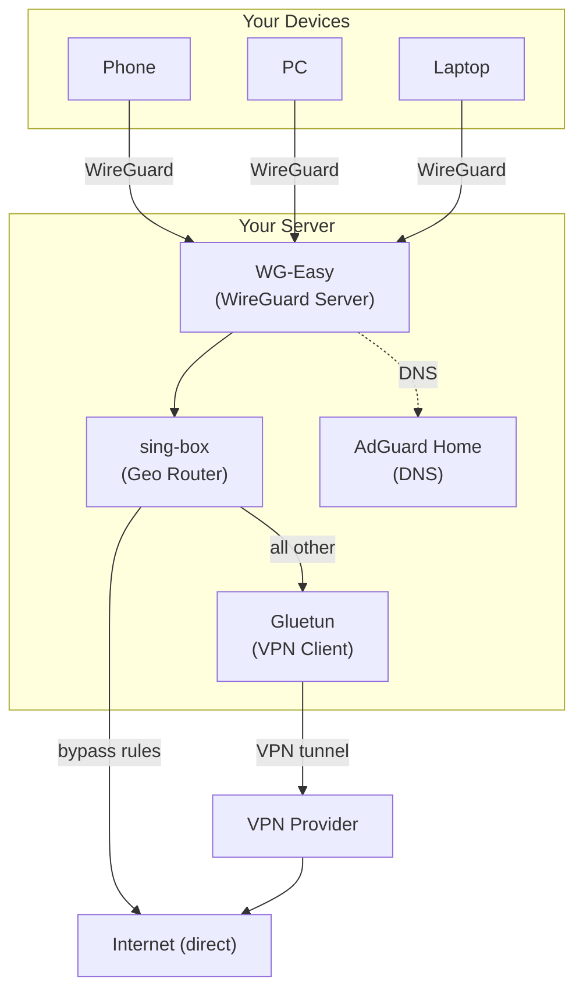

# WireGuard Easy & Gluetun

Build your own self-hosted VPN gateway with a secure and privacy-enhanced exit.

All your devices securely connect to your private WireGuard server, where traffic
is managed and monitored under your control. From there, sing-box applies
geo-routing rules, and Gluetun forwards everything through your trusted VPN
provider — giving you a single encrypted exit IP, enhanced privacy, and location
masking.

- **Easy WireGuard Management**: Simple web interface for managing WireGuard peers (WG-Easy)
- **VPN Chaining**: All traffic routed through a VPN provider via Gluetun
- **Smart Routing**: sing-box applies geo-based bypass rules before traffic reaches the VPN
- **DNS Filtering**: Integrated AdGuard Home for ad-blocking and tracking protection
- **Single Config File**: All settings live in `config.yaml` — one edit, then `./up.sh`
- **Docker-Based**: Easy deployment, no Python or other tools required on the host

> **Want to learn more?** Check out this [detailed introduction article](https://blog.bktus.com/en/archives/qqyy2t/) explaining the principles and architecture of this VPN chaining setup.

## Table of Contents

- [WireGuard Easy \& Gluetun](#wireguard-easy--gluetun)
  - [Table of Contents](#table-of-contents)
  - [Prerequisites](#prerequisites)
  - [Architecture](#architecture)
  - [Quick Start](#quick-start)
    - [1. Clone the Repository](#1-clone-the-repository)
    - [2. Edit `config.yaml`](#2-edit-configyaml)
    - [3. Start the Stack](#3-start-the-stack)
    - [4. Access Web Interfaces](#4-access-web-interfaces)
  - [Configuration](#configuration)
    - [Key Settings](#key-settings)
    - [Adding WireGuard Clients](#adding-wireguard-clients)
    - [Routing Rules (sing-box)](#routing-rules-sing-box)
    - [Direct Subnets (bypass sing-box)](#direct-subnets-bypass-sing-box)
    - [Port Forwarding](#port-forwarding)
  - [Web Interfaces](#web-interfaces)
    - [WG-Easy — `http://YOUR_SERVER_IP:51821`](#wg-easy--httpyour_server_ip51821)
    - [AdGuard Home — `http://172.31.0.16`](#adguard-home--http17231016)
    - [MetaCubeXD — `http://YOUR_SERVER_IP:9091`](#metacubexd--httpyour_server_ip9091)
  - [Management](#management)
    - [View Logs](#view-logs)
    - [Stop / Restart](#stop--restart)
    - [Update Images](#update-images)
    - [Complete Cleanup](#complete-cleanup)
  - [Troubleshooting](#troubleshooting)
  - [Additional Resources](#additional-resources)
  - [Contributing](#contributing)
  - [Disclaimer](#disclaimer)

## Prerequisites

- Docker Engine 20.10 or later
- Docker Compose V2 or later
- A VPN provider account supported by [Gluetun](https://github.com/qdm12/gluetun-wiki)
- Root/sudo access on the host machine

Tested on: Raspberry Pi 5 / Linux Kernel v6.18 / Docker v29.2.1 / Docker Compose v5.0.2

## Architecture


```mermaid
flowchart TD
  subgraph devices["Your Devices"]
    phone["Phone"]
    pc["PC"]
    laptop["Laptop"]
  end
  subgraph server["Your Server"]
    wgeasy["WG-Easy\n(WireGuard Server)"]
    singbox["sing-box\n(Geo Router)"]
    gluetun["Gluetun\n(VPN Client)"]
    adguard["AdGuard Home\n(DNS)"]
  end
  phone  -- WireGuard --> wgeasy
  pc     -- WireGuard --> wgeasy
  laptop -- WireGuard --> wgeasy
  wgeasy --> singbox
  singbox -- bypass rules --> internet["Internet (direct)"]
  singbox -- all other --> gluetun
  gluetun -- VPN tunnel --> provider["VPN Provider"]
  provider --> internet
  wgeasy -. DNS .-> adguard
```

**Traffic flow:**

1. Device connects to wg-easy via WireGuard (encrypted)
2. wg-easy forwards traffic to sing-box via policy routing
3. sing-box checks geo-routing rules — matching bypass sets go direct, everything else continues
4. Gluetun encapsulates remaining traffic through the VPN provider tunnel
5. Traffic exits at the VPN provider's IP address

## Quick Start

### 1. Clone the Repository

```shell
git clone https://github.com/saturneric/wg-easy-gluetun.git
cd wg-easy-gluetun
```

### 2. Edit `config.yaml`

`config.yaml` is the single source of truth for all settings. Fill in at minimum:

```yaml
vpn:
  wireguard:
    private_key: "YOUR_WIREGUARD_PRIVATE_KEY"
    addresses: "YOUR_VPN_ASSIGNED_IP/32"
    # ... other fields from your VPN provider

wg_easy:
  init:
    password: "YOUR_WGEASY_WEB_UI_PASSWORD"
    public_host: "YOUR_SERVER_IP_OR_DOMAIN"

singbox:
  api_host: "YOUR_SERVER_LAN_IP" # used by MetaCubeXD dashboard
```

See the comments in `config.yaml` for all available options.

### 3. Start the Stack

```shell
./up.sh -d
```

`up.sh` runs the `config-gen` service first, which generates `runtime/docker-compose.yml`
and all config files under `runtime/` from your `config.yaml`. It then starts the full
stack with the generated compose file.

> **Always use `./up.sh`** instead of `docker compose up` directly — the generated
> `runtime/docker-compose.yml` requires `--project-directory` flags that `up.sh` handles.

### 4. Access Web Interfaces

| Service      | URL                           |
| ------------ | ----------------------------- |
| WG-Easy      | `http://YOUR_SERVER_IP:51821` |
| AdGuard Home | `http://172.31.0.16`          |
| MetaCubeXD   | `http://YOUR_SERVER_IP:9091`  |

## Configuration

All configuration is done by editing `config.yaml`, then re-running `./up.sh -d`.
**Never edit files under `runtime/` directly** — they are overwritten on every run.

### Key Settings

| Section              | Key                                    | Description                                                 |
| -------------------- | -------------------------------------- | ----------------------------------------------------------- |
| `vpn.wireguard`      | `private_key`, `addresses`, etc.       | WireGuard credentials from your VPN provider                |
| `vpn`                | `service_provider`, `server_countries` | Gluetun provider and server selection                       |
| `vpn`                | `firewall_outbound_subnets`            | Subnets allowed out without going through the VPN           |
| `wg_easy.init`       | `password`, `public_host`              | WG-Easy web UI password and server public address           |
| `adguardhome`        | `upstream_dns`                         | DNS upstream resolvers                                      |
| `singbox`            | `bypass_rule_sets`                     | Geo rule sets whose traffic goes direct (not through VPN)   |
| `singbox`            | `api_host`                             | Your server's LAN IP — pre-fills the MetaCubeXD backend URL |
| `network.services.*` | `ipv4`, `ipv6`                         | Fixed container IPs (must match across all entries)         |

### Adding WireGuard Clients

1. Open WG-Easy at `http://YOUR_SERVER_IP:51821`
2. Click **New**
3. Enter a device name
4. Scan the QR code or download the config file

### Routing Rules (sing-box)

Traffic matching `bypass_rule_sets` in `config.yaml` is sent directly to the internet
(bypassing the VPN tunnel). Everything else goes through Gluetun.

```yaml
singbox:
  bypass_rule_sets:
    - tag: "geoip-cn"
      url: "https://raw.githubusercontent.com/SagerNet/sing-geoip/rule-set/geoip-cn.srs"
    - tag: "geosite-openai"
      url: "https://raw.githubusercontent.com/SagerNet/sing-geosite/rule-set/geosite-openai.srs"
```

Use `extra_rule_sets` to download rule sets without routing them — useful for
activating them later via the MetaCubeXD dashboard.

### Direct Subnets (bypass sing-box)

To let specific subnets bypass sing-box entirely (routed straight to Gluetun, subject
to Gluetun's `firewall_outbound_subnets`):

```yaml
wg_easy:
  direct_subnets:
    - "192.168.1.0/24"
  direct_subnets_ipv6:
    - "fd00::/8"
```

### Port Forwarding

Open these ports on your server firewall / router:

| Port    | Protocol | Service                   |
| ------- | -------- | ------------------------- |
| `51820` | UDP      | WireGuard VPN             |
| `51821` | TCP      | WG-Easy web UI (optional) |

## Web Interfaces

### WG-Easy — `http://YOUR_SERVER_IP:51821`

Manage WireGuard peers, download client configs, view connection status.

### AdGuard Home — `http://172.31.0.16`

DNS dashboard (accessible only from clients connected via WireGuard). Configure
upstream resolvers, blocklists, and query logs.

> AdGuard Home is optional. To disable it, remove the `adguardhome` service from
> `templates/docker-compose.yml.j2` and set a public DNS in `vpn` → `DNS_UPSTREAM_PLAIN_ADDRESSES`
> in `templates/env.j2`.

### MetaCubeXD — `http://YOUR_SERVER_IP:9091`

Dashboard for sing-box. Shows active connections, rule matches, and allows switching
routing modes. The backend URL (`http://YOUR_SERVER_LAN_IP:9090`) is pre-configured
from `singbox.api_host` in `config.yaml`. Leave the secret field empty if
`clash_api_secret` is blank.

## Management

All `docker compose` commands require pointing at the generated compose file:

```shell
docker compose -f runtime/docker-compose.yml --project-directory . <command>
```

### View Logs

```shell
# All services
docker compose -f runtime/docker-compose.yml --project-directory . logs -f

# Single service
docker compose -f runtime/docker-compose.yml --project-directory . logs -f gluetun
```

### Stop / Restart

```shell
# Stop
docker compose -f runtime/docker-compose.yml --project-directory . down

# Restart a single service
docker compose -f runtime/docker-compose.yml --project-directory . restart sing-box
```

### Update Images

```shell
docker compose -f runtime/docker-compose.yml --project-directory . pull
./up.sh -d
```

### Complete Cleanup

```shell
docker compose -f runtime/docker-compose.yml --project-directory . down --rmi all -v
rm -rf runtime/
```

> **Warning**: This deletes all data including WireGuard peer configurations.
> Back up `runtime/data/wg-easy/` before running.

## Troubleshooting

**Containers not starting / env file missing:**
Always use `./up.sh` — it generates `runtime/` before starting the stack.

**Check container status:**

```shell
docker compose -f runtime/docker-compose.yml --project-directory . ps
```

**VPN not connecting:**

```shell
docker compose -f runtime/docker-compose.yml --project-directory . logs gluetun
```

**DNS leaks / no internet on clients:**
Ensure AdGuard Home is reachable at `172.31.0.16` from inside the WireGuard tunnel.
Check `adguardhome` logs for upstream DNS errors.

**sing-box routing issues:**
Open MetaCubeXD at `http://YOUR_SERVER_IP:9091` to inspect active rules and connections.

## Additional Resources

- [WireGuard Documentation](https://www.wireguard.com/)
- [Gluetun Wiki](https://github.com/qdm12/gluetun-wiki)
- [WG-Easy](https://wg-easy.github.io/wg-easy/)
- [sing-box Documentation](https://sing-box.sagernet.org/)
- [MetaCubeXD](https://github.com/MetaCubeX/metacubexd)
- [Docker Compose Documentation](https://docs.docker.com/compose/)

## Contributing

Contributions are welcome! Please feel free to submit a Pull Request.

- **Report Issues**: Found a bug? Open an issue.
- **Suggest Features**: Have ideas for improvements?
- **Submit Pull Requests**: Code contributions are appreciated.
- **Upstream Contributions**: Usability improvements may be contributed back to the wg-easy project.

## Disclaimer

This tool is for educational and personal use only. Please ensure compliance
with your VPN provider's terms of service and local regulations.
